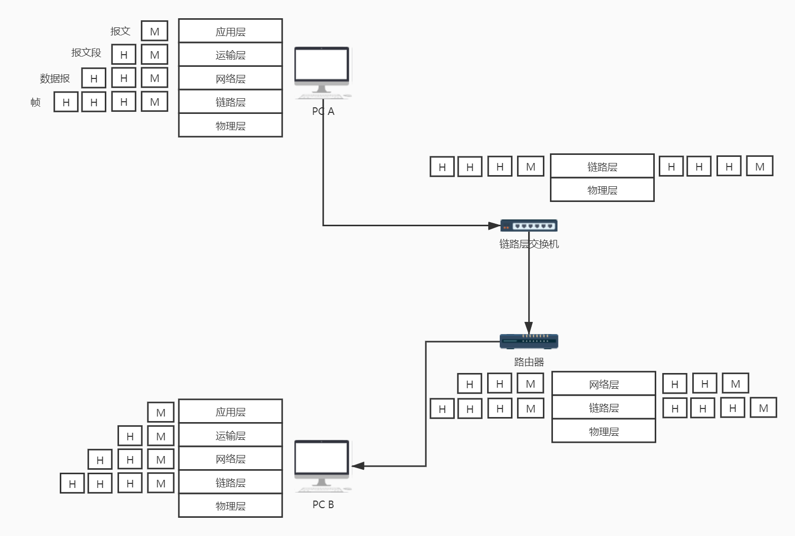
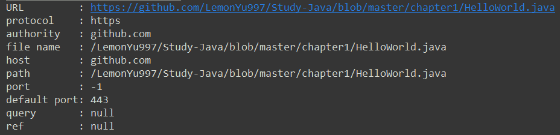
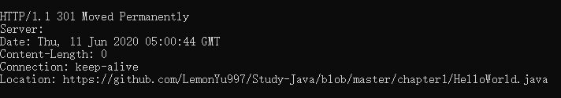
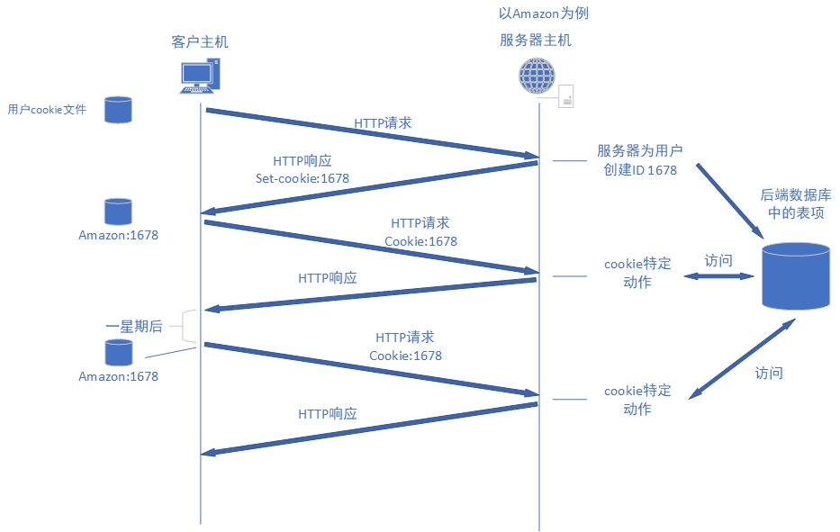
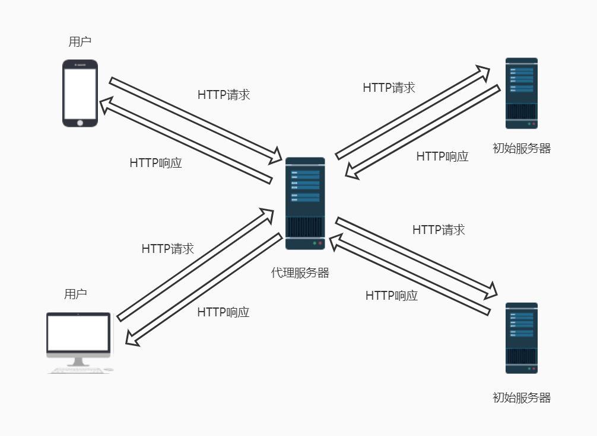
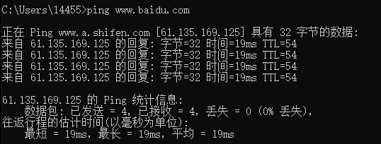
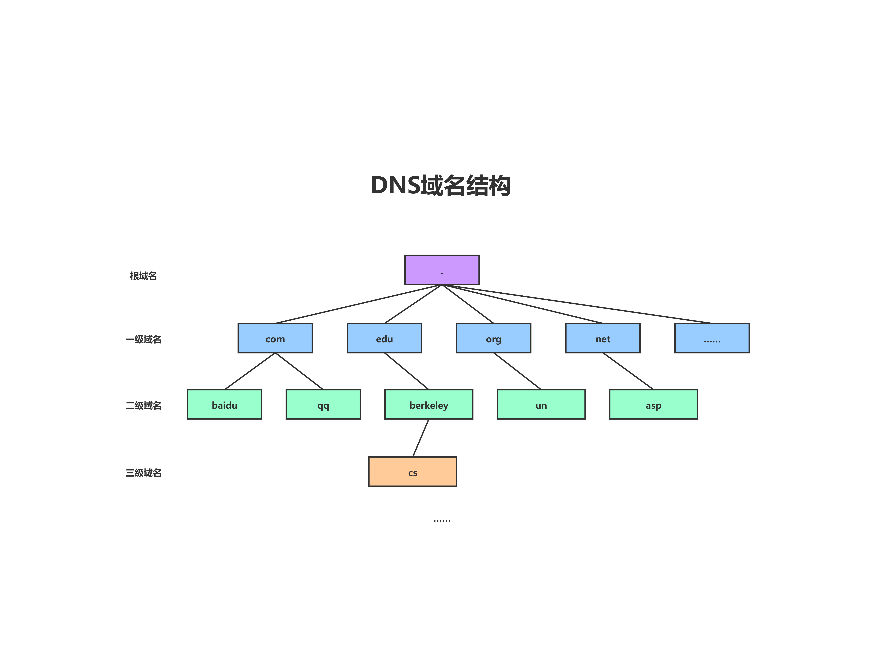

# 计算机网络

## 一、概述

### 1、互联网的组成

#### 1.1 边缘部分

+ 主机/端系统 Host
  + 客户 Client
  + 服务器 Server

#### 1.2 接入网

端系统通过**因特网服务提供商(Internet Server Provider, ISP)**接入因特网。常见形式：

1. 家庭接入：DSL、电缆、FTTH、拨号、卫星

   **DSL：**数字用户线，Digital Subscriber Line

   **FTTH：**光纤到户，Fiber To The Home

2. 企业（家庭）接入：以太网和WIFI

3. 广域无线接入：4G和LTE

#### 1.3 核心部分

大量的网络和连接这些网络的**路由器**组成，为边缘主机提供服务。


### 2、分组交换与电路交换

#### 2.1 分组交换

分组交换用到了**存储转发**。端系统彼此交换**报文(message)**，而报文可能很长，将长报文分割为较小的数据块，满足分组能处理的大小。每个切分的数据块前加上首部之后就成为了**分组(packet)**，首部包含了目的地址和源地址等控制信息。

在源和目的地之间，每个分组都通过通信链路和**分组交换机(packet switch)**传送。交换机分为两类：**路由器(router)**和**链路层交换机(link-layer switch)**。

存储转发允许在一条传输线路上传送多个主机的分组，因此**不需要占用端到端的线路资源**。

#### 2.2 电路交换

用于电话通信系统，两个用户通信之前先建立一条专用的物理链路，并且在通信过程中始终占用，第三方无法共享该链路。用于通信过程中不可能一直使用传输链路，因此电路交换机的利用率很低。

#### 2.3 对比

分组交换相比电路交换：

1. 提供更好的带宽共享
2. 比电路交换简单、有效，实现成本低
3. 分组交换按需分配，电路交换一视同仁


### 3、网络性能指标

1. **速率：**每秒传输的二进制的位数，100Mbs = 12.5MB/S，1B (Byte) = 8 bit
2. **带宽：**单位时间内信道能传输的数据量
3. **吞吐量**：设备能接受的最大数据量，单位时间内通过某网络（信道或接口）的实际数据量
4. **时延(delay)：**
   1. 发送时延：发送端发送一个完整数据帧所需要的时间
   2. 传播时延：电磁波在信道中传播需要的时间，电磁波传输速度接近光速
   3. 处理时延：主机或路由器处理数据分组花费的时间
   4. 排队时延：在路由器中等待分组的时间
5. **时延带宽积：**时延与带宽的积，以比特为单位的链路长度
6. **往返时间RTT(Round-Trip Time)：**表示从发送端发送数据开始，到发送端收到来自接收端的确认（接收端收到数据后便立即发送确认），总共经历的时延
7. **利用率：**信道利用率和网络利用率


### 4、计算机网络体系结构

#### 4.1 协议

**协议(protocol)：**定义了两个或多个通信实体之间进行数据交换的规则、标准、约定等的集合。

#### 4.2 OSI七层模型

+ 应用层(Application，A)
+ 表示层(Presentation，P)
+ 会话层(Session，S)
+ 运输层(Transport，T)
+ 网络层(Network，N)
+ 链路层(Data-link，D)
+ 物理层(Physical，PH)

#### 4.3 协议分层五层模型

协议分层具有概念化和结构化的优点，各层的所有协议称为**协议栈(protocol stack)**。

+ **应用层**：通过应用进程之间交互完成特定的网络应用。
  + 数据：**报文(message)**
  + 协议：**HTTP(网页)**、SMTP(邮件)、FTP(文件)
+ **运输层**：向两个主机进程之间的通信提供通用的数据传输服务
  + 数据：**报文段(segment)**
  + 协议：**TCP**、UDP
+ **网络层**：为分组交换网上的不同主机提供通信服务
  + 数据：**数据报(datagram)**
  + 协议：**IP**
+ **链路层**：为分组在节点之间传输提供服务
  + 数据：**帧(frame)**
  + 协议：**以太网**、WIFI、电缆接入网的DOCSIS
+ **物理层**：将帧中一个个比特从上一个节点移动到下一个节点，与链路实际传输媒体有关(铜缆、光纤等)
  + 数据：比特




## 二、应用层

### 1、原理

#### 1.1 应用程序体系结构

**应用程序体系结构(application architecture)**主要有两种：

+ **客户-服务器体系结构(C/S)：**一个总是打开的主机称为**服务器(server)**，服务的其他主机称为**客户(client)**。
+ **P2P体系结构(Peer-to-Peer)：**对等网络，主机之间直接通信。

#### 1.2 进程通信

+ 对程序来讲，进行通信的实际是**进程(process)**
+ 网络应用程序由成对的进程组成，分别称为**客户**和**服务器**，一般
  + 发起通信的进程标示为**客户**
  + 会话开始时等待联系的进程为**服务器**
+ 进程通过一个称为**套接字(socket)**的软件接口向网络收发报文，套接字是建立网络应用程序的可编程接口，因此套接字也称为应用程序和网络之间的**应用程序编程接口(Application Programming Interface，API)**
+ **进程寻址：**
  + 主机地址：IP
  + 端口号：port

#### 1.4 应用层协议

**应用层协议**定义了运行在不同端系统上的应用程序进程如何相互传递报文，主要有：

+ 交换的报文类型，例如请求报文和响应报文
+ 各种报文类型的语法，如报文中各个字段及其如何描述
+ 字段语义，报文中字段信息的含义
+ 确定一个进程何时以及如何发送报文，对报文进行响应


### 2、Web和HTTP

#### 2.1 HTTP概况

Web即**万维网(World Wide Web， WWW)**，是一个查找和浏览信息的网络应用。Web的应用层协议是**超文本传输协议(HyperText Transfer Protocol，HTTP)**。

HTTP由一个用户程序和一个服务器程序实现，分别运行在不同的端系统中。

支撑HTTP的运输层协议是TCP。

HTTP的**连接方式**：

+ **非持续链接(non-persistent connection)：**TCP连接在服务器发送一个对象后关闭
+ **持续链接(persistent connection)：**服务器发送响应后保持TCP连接打开，一定时间间隔未使用时才断开

#### 2.2 URL详解

首先区分**URI**和**URL**的概念：

+ **URI(Uniform Resource Identifier)：**统一资源标识符，用于标识标示一个抽象或者物理资源
+ **URL(Uniform Resource Locator)：**统一资源定位符，标示网络资源的位置
+ 也就是说URI是以一种抽象的，高层次概念定义统一资源标识，而URL则是具体的资源标识的方式，**URL是一种URI**

**URL**主要包含以下内容：

+ **协议(protocol)：**指定使用的传输协议
+ **主机名(host)：**存放资源的域名或者IP地址
+ **端口号(port)：**各个协议都有默认端口号
+ **路径(path)：**由0或多个"/"隔开的字符串，表示主机上的目录或地址文件
+ **查询(query)：**给动态网页传递参数，用"&"隔开，参数名和值用"="隔开
+ **注释(ref)：**鼠标移上去显示的内容

示例，用Java对URL操作：

```JAVA
//得到URL各部分内容
public class UrlTest {
    public static void main(String[] args) throws MalformedURLException {
        URL url = new URL("https://github.com/LemonYu997/Study-Java/blob/master/chapter1/HelloWorld.java");
        System.out.println("URL         : " + url.toString());
        System.out.println("protocol    : " + url.getProtocol());
        System.out.println("authority   : " + url.getAuthority());
        System.out.println("file name   : " + url.getFile());
        System.out.println("host        : " + url.getHost());
        System.out.println("path        : " + url.getPath());
        System.out.println("port        : " + url.getPort());           //由于实例没有设置端口号，返回-1
        System.out.println("default port: " + url.getDefaultPort());
        System.out.println("query       : " + url.getQuery());
        System.out.println("ref         : " + url.getRef());
    }
}
```

输出结果如下：



#### 2.3 HTTP报文

请求报文，以GET方法为例：

```java
//GET这一行是请求行
GET /somedir/page.html HTTP/1.1			//请求对象及HTTP版本
//以下内容是首部行
Host: www.someschool.edu				//主机名
Connection: close						//请求完成后就关闭该连接
User-agent: Mozilla/5.0					//用户代理，浏览器类型
Accept-language: fr    					//得到该对象的法语版本
```

响应报文示例：

```java
//第一行是状态行(status line)
HTTP/1.1 200 OK							//协议版本，状态码，状态信息
//以下是首部行(header line)
Connection: close						//发送完报文后关闭TCP连接
Date: Tue, 18 Aug 2015 15:44:04 GMT		//发送时间
Server: Apache/2.2.3(CentOS)			//服务器信息
Last-Modified: Tue, 18 Aug 2015 15:11:03 GMT	//对象创建或者最后修改的日期和时间
Content-Length: 6821					//被发送对象中的字节数
Content-Type: text/html					//对象类型，是html文本

//实体体(entity body)
(data data data data data...)
```

常见状态码：

| 状态码                         | 说明                                                         |
| ------------------------------ | ------------------------------------------------------------ |
| 200 OK                         | 请求成功，信息在返回响应报文中                               |
| 301 Moved Permanently          | 请求的对象被永久转移，新的URL定义在响应报文的Location首部行中，客户软件自动获取新的URL |
| 400 Bad Request                | 通用差错代码，该请求不能被服务器理解                         |
| **404 Not Found**              | 被请求的文档不在服务器上                                     |
| 505 HTTP Version Not Supported | 服务器不支持请求报文使用的HTTP版本                           |

实机操作，在shell中获取响应报文：

```shell
telnet github.com 80

GET /LemonYu997/Study-Java/blob/master/chapter1/HelloWorld.java HTTP/1.1
Host: github.com
#之后按两次回车
```



#### 2.4 cookie

cookie可以使Web服务器识别用户，用于标识用户。Web服务器可以根据cookie知道某一特定用户访问了哪些页面。



#### 2.5 Web缓存

**Web缓存(Web cache)**也叫**代理服务器(proxy server)**，将用户请求的对象缓存在代理服务器上，在下次访问同样的内容时可以快速响应。

一般由ISP部署。



#### 2.6 HTTPS

超文本传输协议HTTP协议被用于在Web浏览器和网站服务器之间传递信息，HTTP协议以**明文方式**发送内容，不提供任何方式的数据加密，如果攻击者截取了Web浏览器和网站服务器之间的传输报文，就可以直接读懂其中的信息，因此，HTTP协议不适合传输一些敏感信息，比如：信用卡号、密码等支付信息。

为了解决HTTP协议的这一缺陷，需要使用另一种协议：**安全套接字层超文本传输协议HTTPS**，为了数据传输的安全，HTTPS在HTTP的基础上加入了**SSL协议（Secure Sockets Layer）**，SSL依靠证书来验证服务器的身份，并为浏览器和服务器之间的通信加密。

HTTPS协议的主要作用可以分为两种：

+ 一建立一个信息安全通道，来保证数据传输的安全
+ 确认网站的真实性

HTTP和HTTPS的**区别**：

+ HTTP是超文本传输协议，信息是明文传输，HTTPS则是具有安全性的SSL加密传输协议。

+ HTTP和HTTPS使用的是完全不同的连接方式，用的端口也不一样，前者是80，后者是443。

+ HTTP的连接很简单，是无状态的；HTTPS协议是由SSL+HTTP协议构建的可进行加密传输、身份认证的网络协议，比HTTP协议安全。
  

### 3、电子邮件和SMTP

**SMTP(Simple Mail Transfer Protocol)**即**简单邮件传输协议**，它是一组用于由源地址到目的地址传送邮件的规则，由它来控制信件的中转方式。 

SMTP协议属于TCP/IP协议簇，它帮助每台计算机在发送或中转信件时找到下一个目的地。

通过SMTP协议所指定的服务器，就可以把E-mail寄到收信人的服务器上，整个过程只要几分钟。SMTP服务器则是遵循SMTP协议的发送邮件服务器，用来发送或中转发出的电子邮件。


### 4、DNS

**域名系统(Domain Name System，DNS)**将**域名(主机名)**解析为IP地址。

示例，在shell中使用ping：

```shell
ping www.baidu.com
#www.baidu.com就是域名
```

可以得到对应的IP地址：



可以看到百度的IP地址是61.135.169.125。

DNS域名结构示意图如下：




